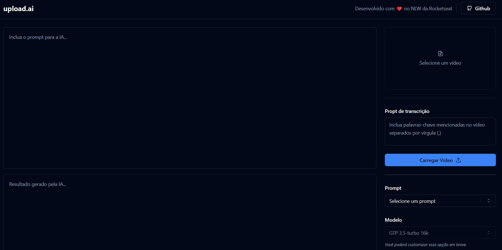

# NLW | Upload AI Web 🚀





## Table of Content 📜
<!--ts-->
   * [About](#about-ℹ️)
   * [About NLW](#about-nlw-🚀)
   * [DEMO](#demo-🚀)
   * [Technologies Used](#technologies-used-⚙️)
   * [Features](#features-✅)
   * [Package Dependencies](#package-dependencies-⬇️)
   * [Running the Project](#running-the-project-🏃)
   * [What I learn](#what-i-learn-📝)
   * [Acknowledge](#acknowledge-☺️)
   * [License](#license-📖)
<!--te-->

## About ℹ️

Welcome to the Upload AI Web project, where you can effortlessly upload videos and have automatic titles and descriptions generated for you.

## About NLW 🚀

NLW (Next Level Week) is an event organized by Rocketseat, dedicated to exploring cutting-edge technologies and empowering programmers to build high-quality projects quickly.

This project was created during NLW to embrace and master the latest technologies, resulting in an application powered by multiple advanced technologies.


## DEMO 🚀

To access the application click on link [Application DEMO](https://nlw-upload-ai.vercel.app/)

## Technologies Used ⚙️

The technologies utilized in this project include:

* [ReactJS + Vite](https://vitejs.dev/)
* [Typescript](https://www.typescriptlang.org/)
* [Tailwind](https://tailwindcss.com/)
* [Shadcn/UI](https://ui.shadcn.com/)

## Features ✅

- [X] Create Screens
- [ ] Integrate a Back-end
- [ ] Integrate OpenAI

## Package Dependencies ⬇️

Here is a list of the project's package dependencies:

```json
"dependencies": {
    "@radix-ui/react-icons": "^1.3.0",
    "@radix-ui/react-label": "^2.0.2",
    "@radix-ui/react-select": "^1.2.2",
    "@radix-ui/react-separator": "^1.0.3",
    "@radix-ui/react-slider": "^1.1.2",
    "@radix-ui/react-slot": "^1.0.2",
    "class-variance-authority": "^0.7.0",
    "clsx": "^2.0.0",
    "lucide-react": "^0.276.0",
    "react": "^18.2.0",
    "react-dom": "^18.2.0",
    "tailwind-merge": "^1.14.0",
    "tailwindcss-animate": "^1.0.7"
},
"devDependencies": {
    "@types/node": "^20.6.0",
    "@types/react": "^18.2.15",
    "@types/react-dom": "^18.2.7",
    "@typescript-eslint/eslint-plugin": "^6.0.0",
    "@typescript-eslint/parser": "^6.0.0",
    "@vitejs/plugin-react": "^4.0.3",
    "autoprefixer": "^10.4.15",
    "eslint": "^8.45.0",
    "eslint-plugin-react-hooks": "^4.6.0",
    "eslint-plugin-react-refresh": "^0.4.3",
    "postcss": "^8.4.29",
    "tailwindcss": "^3.3.3",
    "typescript": "^5.0.2",
    "vite": "^4.4.5"
}
```


## Running the Project 🏃

To get started with the project, follow these steps:

1. Install the project dependencies:

```
pnpm i
```

2. Execute the following command in your terminal to run the project:

```
pnpm run dev
```


## What I learn 📝

### Tailwind

One key takeaway from this project is the power of Tailwind CSS in simplifying the process of creating stylish designs using only class-based components. For example:

```tsx
<span className="text-sm text-muted-foreground">
    Desenvolvido com ❤️ no NLW da Rocketseat
</span>
```

### Shadcn/UI

I discovered that the Shadcn/UI package offers pre-designed components with beautiful styles that can be easily customized using Tailwind CSS. This library includes various designs that can be added to the src/components folder.

I began using Shadcn/UI by initializing it with the following command:

```shell
pnpm dlx shadcn-ui@latest init
```

I then incorporated these components into my project using the following commands:

```shell
pnpm dlx shadcn-ui@latest add slider
pnpm dlx shadcn-ui@latest add select
pnpm dlx shadcn-ui@latest add label
pnpm dlx shadcn-ui@latest add textarea
pnpm dlx shadcn-ui@latest add separator
pnpm dlx shadcn-ui@latest add button
```

This made it convenient to enhance my project's user interface with these pre-designed components.

## Acknowledge ☺️

A special thanks to Rocketseat and their dedicated instructors who provide incredible content to the React community, making projects like this possible. Your guidance and support are greatly appreciated.

## License 📖

This project is open-source and is distributed under the MIT License. Feel free to explore, modify, and utilize the codebase according to the terms outlined in the license.